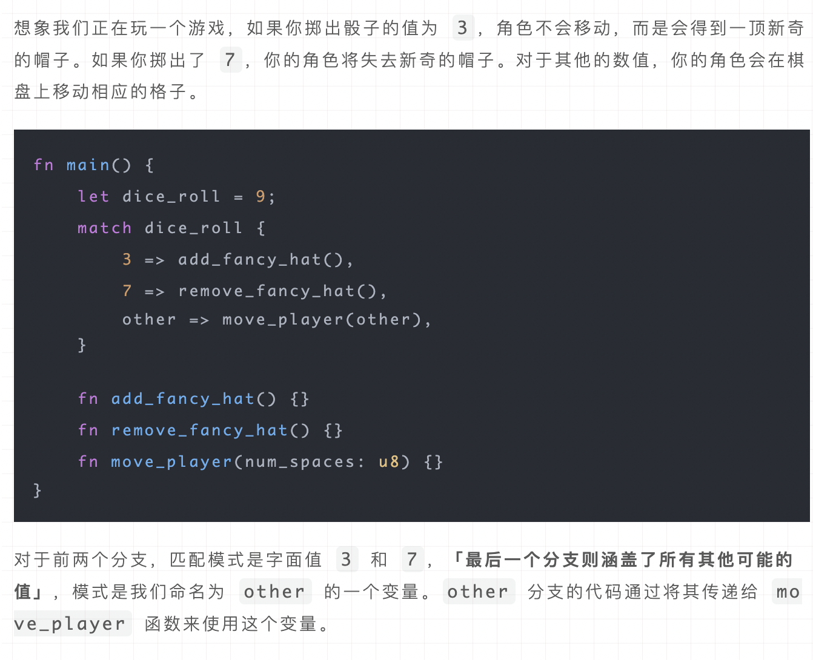

# Rust 语言入门

## 使用 Rust 写算法题

这里简单介绍使用 Rust 写算法题时的一些特点。本项目并不是一个 Rust 教程，所以默认大家对 Rust 有一定的了解，对于零基础的同学建议首先了解一下 Rust 的基本语法等基础知识。

### 逻辑

进行 coding 面试时，如果不指定使用的编程语言，一般来讲考察的是做题的思路而不是编程本身，因此不需要从零开始实现一些基础的数据结构或算法，利用语言的一些特性和自带的标准库可以大大简化代码，提高做题速度。下面会总结一些 Rust 常用的特性，标准算法和数据结构。

## 常用数据结构


### 栈 Stack LIFO

在 Rust 中，可以使用`Vec`来模拟栈的行为，利用其`push`和`pop`方法：

```rust
let mut stack = Vec::new();
stack.push(1);
stack.push(2);
stack.push(3);
println!("栈顶元素是：{:?}", stack.pop()); // 输出：Some(3)
```

> Vec::new(): Vec::new()用于创建一个新的、空的向量（动态数组）。Vec是 Rust 的一个泛型集合类型，它可以存储多个 T 类型的值（其中 T 可以是任意类型）。这种方法不包含任何初始元素。 示例：创建一个空的 i32 类型向量。

```rust
let v: Vec<i32> = Vec::new();
// 这里v是一个空的Vec<i32>类型的向量，可以在之后向其中添加元素。
```

### 队列 Queue FIFO

Rust 没有内置的队列类型，但可以使用`VecDeque`来模拟队列的行为：

```rust
use std::collections::VecDeque;

let mut queue = VecDeque::new();
queue.push_back(1);
queue.push_back(2);
queue.push_back(3);
println!("队首元素是：{:?}", queue.pop_front()); // 输出：Some(1)
```

### 堆

Rust 的`BinaryHeap`提供了一个二叉堆实现，可用于创建优先队列：

```rust
use std::collections::BinaryHeap;

let mut heap = BinaryHeap::new();
heap.push(1);
heap.push(5);
heap.push(2);
println!("最大元素是：{:?}", heap.pop()); // 输出：Some(5)
```

### HashSet，HashTable

Rust 通过`HashSet`和`HashMap`提供了哈希集合和哈希表的支持：

```rust
use std::collections::HashSet;

let mut set = HashSet::new();
set.insert(1);
set.insert(2);
println!("集合包含1？ {}", set.contains(&1)); // 输出：true

use std::collections::HashMap;

let mut map = HashMap::new();
map.insert("color", "red");
println!("'color'键对应的值是：{}", map.get("color").unwrap_or(&"未找到")); // 输出："red"
```

Rust 的强类型系统、内存安全保证以及现代的并发支持，使其成为系统编程和高性能应用开发的有力工具。

## 使用 Rust 写算法题的基本语法

### 排序

在 Rust 中，排序通常使用`Vec`的`sort`或`sort_unstable`方法来实现，这两种方法都会就地排序。`sort`方法保证稳定排序，而`sort_unstable`则可能更快，但不保证稳定性。这里有个简单的示例：

```rust
let mut vec = vec![3, 1, 4, 1, 5, 9, 2, 6];
vec.sort(); // 稳定排序
println!("{:?}", vec); // 输出: [1, 1, 2, 3, 4, 5, 6, 9]
```

### 二分查找

Rust 的`Vec`提供了`binary_search`方法来实现二分查找。如果找到了元素，它返回`Ok(index)`，否则返回`Err(index)`，其中`index`是该元素应当插入的位置保持排序顺序。示例如下：

```rust
let vec = vec![1, 2, 3, 4, 5];
match vec.binary_search(&3) {
    Ok(index) => println!("找到了3，在索引{}处", index),
    Err(_) => println!("没有找到3"),
}
```

> vec!是一个宏，用于创建并初始化一个 Vec类型的向量。它可以接受一个或多个值作为参数，并返回一个包含这些值的向量。当你只有一个参数时，这个向量会包含一个元素；如果有多个值，可以用逗号隔开，向量将包含所有提供的值。 示例：使用 vec!宏创建并初始化一个包含单个元素的向量。

```rust
let root = Some(10); // 假设这是某种类型的值
let v = vec![root];
在这个示例中，v是一个包含单个元素root的向量。
```

> 如果你需要一个空向量并打算稍后添加元素，就用 Vec::new()。如果你在创建向量时已经知道了一个或多个初始元素，就用 vec!\[root]（或者 vec!\[element1, element2, ...]来包含多个元素）

### 变量和可变性

* 默认情况下，Rust 中的变量是不可变的。这是 Rust 旨在帮助您编写安全且易于并发的代码的众多提示之一。
* 可以通过添加 `mut` 关键字使变量可变。

```rust
let x = 5; // 不可变变量
let mut y = 5; // 可变变量
```

* 不可变性有助于预防在编写代码时不小心改变了值应该保持不变的变量。

### 常量

* 常量使用 `const` 关键字声明，并且必须标注类型。
* 常量总是不可变的。不允许将 mut 与常量一起使用。
* 常量可以在任何作用域内声明，包括全局作用域。

```rust
const THREE_HOURS_IN_SECONDS: u32 = 60 * 60 * 3;
```

> Rust 的常量命名约定是全部大写，单词之间使用下划线。编译器能够在编译时评估一组有限的操作，这让我们可以选择以更容易理解和验证的方式写出该值，而不是将此常量设置为值 10,800

### 遮蔽（Shadowing）

* 通过使用相同的变量名重新声明新变量，可以遮蔽之前的变量。

```rust
fn main() {
    let x = 5;

    let x = x + 1;

    {
        let x = x * 2;
        println!("The value of x in the inner scope is: {x}");
    }

    println!("The value of x is: {x}");
}
```

该程序首先将 x 绑定到值 5。然后，它通过重复 let x = 创建一个新变量 x，取原始值并加 1，这样 x 的值就是 6。然后，在使用 curly 创建的内部作用域内括号中，第三个 let 语句也遮蔽 x 并创建一个新变量，将先前的值乘以 2 得到 x 的值 12。当该范围结束时，内部遮蔽结束，x 返回到 6。当我们运行这个程序时，它将输出以下内容：

```Shell
$ cargo run
   Compiling variables v0.1.0 (file:///projects/variables)
    Finished dev [unoptimized + debuginfo] target(s) in 0.31s
     Running `target/debug/variables`
The value of x in the inner scope is: 12
The value of x is: 6
```

### 数据类型

Rust 是一种静态类型语言，意味着它必须在编译时知道所有变量的类型。

#### 标量类型

* 整型（如 `i32`、`u32`）、浮点型（`f32`、`f64`）、布尔型（`bool`）和字符型（`char`）。
*   有符号整数类型以 i 而不是 u 开头

    

    当符号重要时，数字会显示加号或减号；当符号重要时，数字会显示加号或减号；然而，当可以安全地假设该数字为正数时，它会不显示任何符号。

```rust
let int: i32 = 5;
let float: f64 = 3.0; // 默认类型为 f64
let boolean: bool = true;
let character: char = 'a';
```

#### 复合类型

* Rust 有两种 元组（Tuple）和数组（Array）。

```rust
// 元组
let tup: (i32, f64, u8) = (500, 6.4, 1);
let (x, y, z) = tup; // 解构

//我们还可以通过使用句点 (.) 后跟要访问的值的索引来直接访问元组元素
fn main() {
    let x: (i32, f64, u8) = (500, 6.4, 1);
    let five_hundred = x.0;
    let six_point_four = x.1;
    let one = x.2;
}

// 数组; 与元组不同，数组的每个元素必须具有相同的类型。与其他一些语言中的数组不同，Rust 中的数组具有固定长度
let arr: [i32; 5] = [1, 2, 3, 4, 5];

// 数组是可以在堆栈上分配的已知固定大小的单个内存块。可以使用索引访问数组的元素
fn main() {
    let a = [1, 2, 3, 4, 5];

    let first = a[0];
    let second = a[1];
}
```

### 函数

* 使用 `fn` 关键字声明函数。
* Rust 代码使用蛇形命名法作为函数和变量名称的常规样式，**其中所有字母均为小写，并为单独的单词添加下划线**。
* 函数参数必须标注类型。

```rust
fn another_function(x: i32) {
    println!("The value of x is: {x}");
}
```

* 函数可以返回值，并且返回值类型需要在箭头（`->`）后指明。

```rust
fn five() -> i32 {
    5
}
```

### 控制流

#### if

* 使用 `if` 表达式进行条件分支。

```rust
fn main() {
    let number = 6;

    if number % 4 == 0 {
        println!("number is divisible by 4");
    } else if number % 3 == 0 {
        println!("number is divisible by 3");
    } else if number % 2 == 0 {
        println!("number is divisible by 2");
    } else {
        println!("number is not divisible by 4, 3, or 2");
    }
}
```

#### loop, while, for

```rust
// loop
loop {
    println!("again!");
}
---
fn main() {
    let mut counter = 0;

    let result = loop {
        counter += 1;

        if counter == 10 {
            break counter * 2;
        }
    };

    println!("The result is {result}");
}

// while
fn main() {
    let mut number = 3;

    while number != 0 {
        println!("{number}!");

        number -= 1;
    }

    println!("LIFTOFF!!!");
}

// for
for element in a.iter() {
    println!("the value is: {element}");
}


for number in (1..4).rev() {
    println!("{number}!");
}
println!("LIFTOFF!!!");

```


***

#### match

*   **`match` 控制流**：`match` 将一个值与一系列模式进行比较，然后根据匹配到的模式执行相应的代码。

    ```rust
    enum Coin {
        Penny,
        Nickel,
        Dime,
        Quarter,
    }

    fn value_in_cents(coin: Coin) -> u8 {
        match coin {
            Coin::Penny => 1,
            Coin::Nickel => 5,
            Coin::Dime => 10,
            Coin::Quarter => 25,
        }
    }

    // 模式匹配示例
    fn main() {
        let value = 5;

        match value {
            1 => println!("匹配到1"),  // 如果value等于1，执行此分支
            2 | 3 => println!("匹配到2或3"),  // 如果value等于2或3，执行此分支
            4..=6 => println!("匹配到4到6之间的值"),  // 如果value在4到6的范围内，执行此分支
            _ => println!("默认分支"),  // 如果以上条件都不满足，执行默认分支
        }

        let fruit = "apple";

        match fruit {
            "apple" => println!("这是苹果"),
            "banana" => println!("这是香蕉"),
            _ => println!("这是其他水果"),
        }
    }
    ```
* **模式匹配**：模式可以是字面值、变量名、通配符等。`match` 表达式确保所有可能的情况都被处理。

**模式中的值绑定**

*   **绑定到模式中的值**：`match` 手臂（arm）中的模式可以绑定到匹配值的部分。

    ```rust
    fn value_in_cents(coin: Coin) -> u8 {
        match coin {
            Coin::Quarter(state) => {
                println!("州季度币来自 {:?}", state);
                25
            },
            _ => 0, // 使用 `_` 处理其他所有情况
        }
    }
    ```

**`Option<T>` 与 `match`**

* **使用 `Option<T>`**：`Option<T>` 枚举是 Rust 的一种功能，允许编码时可选地包含或不包含值，这使得 Rust 无需使用空值就能处理可能不存在的值。
  * e.g. 获取一个 `Option<i32>` ，如果其中含有一个值，将其加一。如果其中没有值，函数应该返回 `None` 值，而不尝试执行任何操作

```rust
fn plus_one(x: Option<i32>) -> Option<i32> {
    match x {
        None => None,
        Some(i) => Some(i + 1),
    }
}
```


`Rust` 中的匹配是穷举式exhaustive的：必须穷举到最后的可能性来使代码有效


> 参考[前端七八九](https://mp.weixin.qq.com/s/vEWXSFhO1AXBV-ATkZcxnQ)

<figure><figcaption><p>例子：match的函数用法</p></figcaption></figure>

<figure><figcaption><p>例子：通配模式</p></figcaption></figure>

***

#### if let


可以认为 `if let` 是 `match` 的一个**「语法糖」**，它当值匹配某一模式时执行代码而忽略所有其他值。

`if let` 特别适用于 `Option<T>` 和 `Result<T, E>` 这样的枚举，因为它们经常在逻辑中只关心某一个具体的值或结果。


以下两个语句相等：

```rust
fn main() {
  let some_u8_value = Some(0u8);
  match some_u8_value {
      Some(3) => println!("three"),
      _ => (),
  }
}
```

```rust
fn main() {
  let some_u8_value = Some(0u8);
  if let Some(3) = some_u8_value {
      println!("three");
  }
}
```

标准的 `match` 语句需要覆盖枚举的所有可能性。例如，使用 `Option<i32>` 时：

```rust
let some_option: Option<i32> = Some(5);

match some_option {
    Some(x) => println!("找到数字 {}", x),
    None => (),
}
```

如果我们只关心 `Some` 分支，使用 `if let` 可以简化这个匹配过程：

```rust
if let Some(x) = some_option {
    println!("找到数字 {}", x);
}
```

**`else` 分支**

`if let` 还可以与 `else` 配合使用，来处理不匹配模式的情况，这等同于 `match` 语句中的 `_` 分支：

```rust
if let Some(x) = some_option {
    println!("找到数字 {}", x);
} else {
    println!("没有找到数字");
}
```

**解构枚举**

`if let` 不仅可以用于 `Option<T>` 和 `Result<T, E>`，还可以用于任何枚举。例如，考虑以下带有数据的枚举：

```rust
enum Message {
    Quit,
    Move { x: i32, y: i32 },
    Write(String),
}

let message = Message::Write(String::from("hello"));

if let Message::Write(text) = message {
    println!("消息内容：{}", text);
}
```

这里，`if let` 被用来检查 `message` 是否是 `Message::Write` 变体，如果是，它解构出 `text` 并打印出来。

### 泛型（Generics）

* 泛型是 Rust 用于编写函数和类型定义的一种方式，它可以处理多种数据类型。
* 泛型函数例子：

```rust
fn largest<T: PartialOrd + Copy>(list: &[T]) -> T {
    let mut largest = list[0];

    for &item in list.iter() {
        if item > largest {
            largest = item;
        }
    }

    largest
}
```

要参数化新的单个函数中的类型，我们需要命名类型参数，就像我们为函数的值参数所做的那样。您可以使用任何标识符作为类型参数名称。但我们将使用 T，因为按照惯例，Rust 中的类型参数名称很短，通常只是一个字母，并且 Rust 的类型命名约定是 UpperCamelCase。 T 是“type”的缩写，是大多数 Rust 程序员的默认选择。

```rust
fn largest<T>(list: &[T]) -> &T {
```

我们将这个定义理解为：函数 largest 是某种类型 T 的泛型。该函数有一个名为 list 的参数，它是 T 类型值的切片。largest 函数将返回对相同类型 T 的值的引用。

### 所有权和借用

* Rust 通过所有权系统管理内存，编译器在编译时就会根据所有权规则进行检查。
* 变量拥有它们的值，并负责清理这些值。
* 借用分为可变借用 `&mut T` 和不可变借用 `&T`。

```rust
let mut s = String::from("hello");

{
    let r1 = &mut s;
} // r1 在这里离开作用域，所以我们完全可以创建一个新的引用

let r2 = &mut s;
```

1.  **所有权（Ownership）**：Rust 通过所有权系统管理内存，这与 Python 的垃圾回收机制不同。在 Rust 中，每个值都有一个变量作为其所有者，且每个值只能有一个所有者。当所有者离开作用域，值会被自动清理。

    ```rust

    let s = String::from("hello"); // s是变量，拥有它的值
    ```
2.  **借用（Borrowing）**：Rust 允许通过引用来借用值，这样就可以使用值而不取得其所有权。引用分为可变引用和不可变引用。大白话讲就是变量前加&号，只取这个参数的值，而不会把这个的内存地址赋过来，使得原来的失效。

    ```rust

    let s1 = String::from("hello");
    let len = calculate_length(&s1); // 使用&s1来借用s1的值

    fn calculate_length(s: &String) -> usize { // s是对String的引用
        s.len()
    }
    ```

```rust
fn main() {
    let s = String::from("hello");  // s comes into scope

    takes_ownership(s);             // s's value moves into the function...
                                    // ... and so is no longer valid here

    let x = 5;                      // x comes into scope

    makes_copy(x);                  // x would move into the function,
                                    // but i32 is Copy, so it's okay to still
                                    // use x afterward

} // Here, x goes out of scope, then s. But because s's value was moved, nothing
  // special happens.

fn takes_ownership(some_string: String) { // some_string comes into scope
    println!("{}", some_string);
} // Here, some_string goes out of scope and `drop` is called. The backing
  // memory is freed.

fn makes_copy(some_integer: i32) { // some_integer comes into scope
    println!("{}", some_integer);
} // Here, some_integer goes out of scope. Nothing special happens.
```

### `std::mem::` 和范围表达式 `..=`

* `std::mem::swap` 用于交换两个变量的值。
* 范围表达式 `..=` 用于创建一个包含起始值和结束值的范围。

```rust
let mut x = 5;
let mut y = 10;

std::mem::swap(&mut x, &mut y);

for i in 1..=3 {
    println!("{}", i); // 打印 1 到 3
}
```

### 一些其他的知识

**切片（Slices）**：切片允许引用集合中的一段连续元素序列，而不是整个集合。切片是一种不拥有所有权的数据类型。

```rust
let s = String::from("hello world");
let hello = &s[0..5]; // 切片引用"hello"
let world = &s[6..11]; // 切片引用"world"
```

**结构体（Structs）**：类似于 Python 中的类（class），用于自定义数据类型，可以包含多个不同类型的数据。

```rust
struct User {
    username: String,
    email: String,
    sign_in_count: u64,
    active: bool,
}

let user1 = User {
    email: String::from("someone@example.com"),
    username: String::from("someusername123"),
    active: true,
    sign_in_count: 1,
};
```

**枚举（Enums）**：允许定义一个类型，该类型可以是几个不同的具体值之一。与结构体不同，枚举用于当值只能是几个固定变体中的一个时。

```rust
enum IpAddrKind {
    V4,
    V6,
}

let four = IpAddrKind::V4;
let six = IpAddrKind::V6;
```

**模式匹配（Pattern Matching）**：通过`match`控制流构造，可以将一个值与一系列模式进行比较，并执行与第一个匹配的模式关联的代码。

```rust
enum Coin {
    Penny,
    Nickel,
    Dime,
    Quarter,
}

fn value_in_cents(coin: Coin) -> u8 {
    match coin {
        Coin::Penny => 1,
        Coin::Nickel => 5,
        Coin::Dime => 10,
        Coin::Quarter => 25,
    }
}
```

**错误处理（Error Handling）**：Rust 通过`Result`类型来处理可能发生错误的操作。`Result`类型是一个枚举，它的变体是`Ok`和`Err`。

```rust
fn divide(numerator: f64, denominator: f64) -> Result<f64, String> {
    if denominator == 0.0 {
        Err(String::from("除数不能为0"))
    } else {
        Ok(numerator / denominator)
    }
}
```

**特征（Traits）**：定义一组方法，用于在不同类型之间共享行为。类似于其他语言中的接口。与 interface 不同的地方在于，interface 会隐藏具体实现类型，而 trait 不会。

```rust
pub trait Summary {
    fn summarize(&self) -> String;
}

impl Summary for Article {
    fn summarize(&self) -> String {
        format!("{}, by {} ({})", self.headline, self.author, self.location)
    }
}
```
